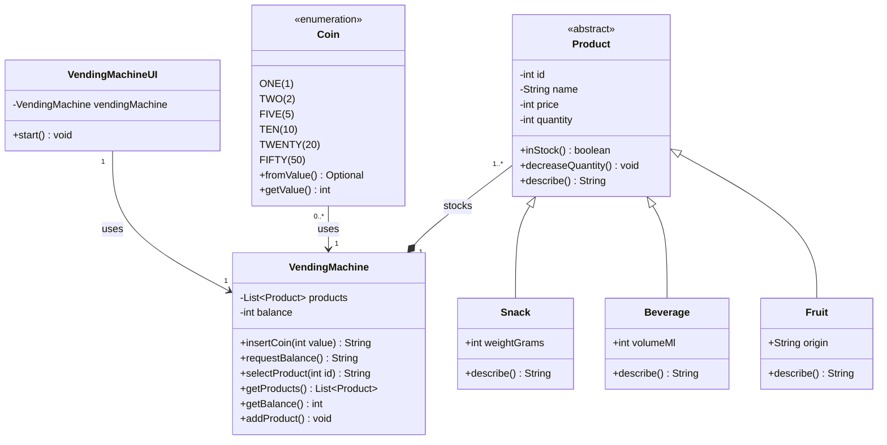

# Class Diagram: Vending Machine WS

```mermaid
classDiagram
    Direction RL
    VendingMachineUI "1" --> "1" VendingMachine : uses
    Product "1..*" --* "1" VendingMachine : stocks
    Product <|-- Snack
    Product <|-- Beverage
    Product <|-- Fruit
    Coin "0..*" --> "1" VendingMachine : uses
    class Product {
        <<abstract>>
        -int id
        -String name
        -int price
        -int quantity
        +inStock() boolean
        +decreaseQuantity() void
        +describe() String
    }
    class Beverage {
        +int volumeMl
        +describe() String
    }
    class Fruit {
        +String origin
        +describe() String
    }
    class Snack {
        +int weightGrams
        +describe() String
    }
    class VendingMachine {
        -List~Product~ products
        -int balance
        +insertCoin(int value) String
        +requestBalance() String
        +selectProduct(int id) String
        +getProducts() List~Product~
        +getBalance() int
        +addProduct() void
    }
    class VendingMachineUI {
        -VendingMachine vendingMachine
        +start() void
    }
    class Coin {
        <<enumeration>>
        ONE(1)
        TWO(2)
        FIVE(5)
        TEN(10)
        TWENTY(20)
        FIFTY(50)
        +fromValue() Optional<Coin>
        +getValue() int
    }


```